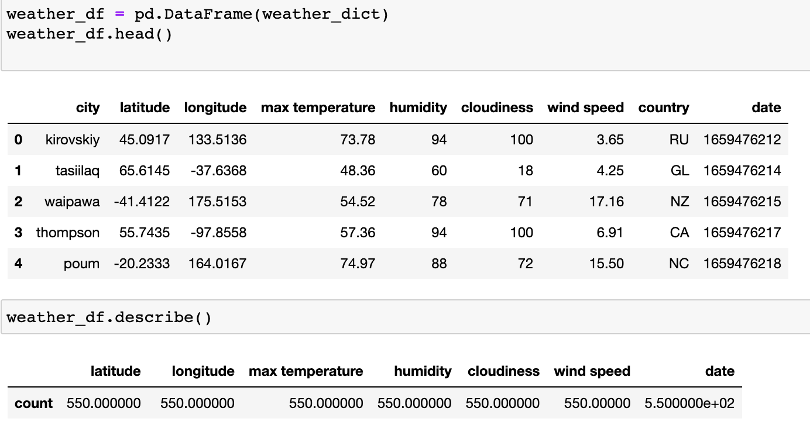
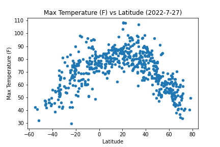
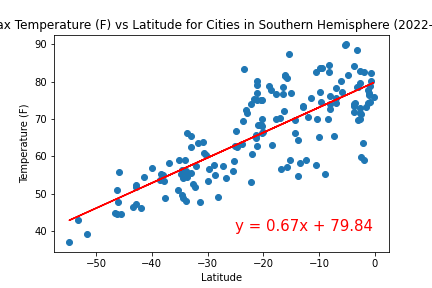
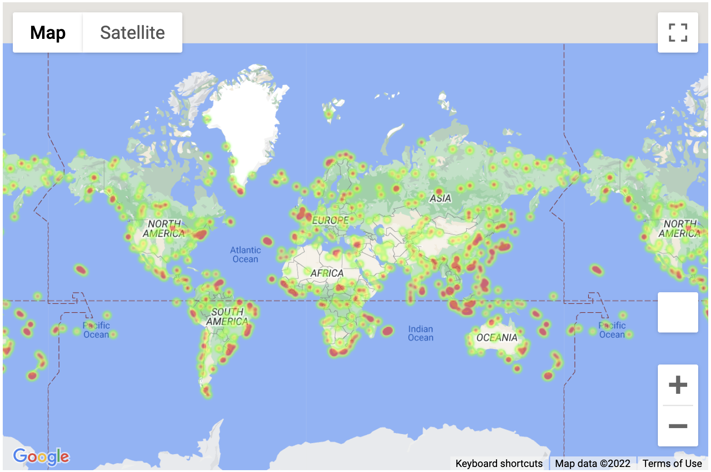
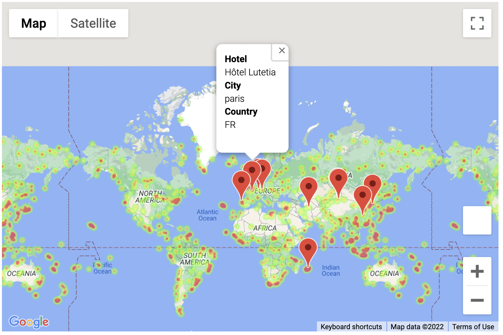

# Weather Analysis

The aim of this project was to determine how latitude affects temperature, humidity, cloud cover, and windspeed. We were then to use this data to find our ideal vacation cities based on weather and find a hotel in each of those cities.

### Generate List of Cities and Query API for Weather Data 
The first step was to generate a list of random cities using the [citipy library](https://pypi.org/project/citipy/). These cities were then used to query the [OpenWeatherMap API](https://openweathermap.org/api) to retrieve weather data for the cities where such data was available. The results were put into a dataframe that contained 550 cities across the globe.  

### Graph Latitude vs X

I used Matplotlib to graph latitude versus the four weather condidtions for all cities in the dataframe.

Then I split the data based on hemisphere and performed linear regressions for all four weather conditions for both hemispheres separately.

### Determine Ideal Vacation Spots

The first task of this part of the assignment was to make a heatmap of max humidity levels using GoogleMaps API:

Using my own criteria, I queried the data frame for cities that matched my ideal vacation weather. I narrowed my criteria such that only a handful of cities would be returned. I used the GoogleMaps API nearby endpoint to find hotels for each city in my list. I took the hotel closest to the city center, appended that information to my dataframe, and mapped each hotel:  

Analyses are in `WeatherPy.ipynb` and  `VacationPy.ipynb`  
`output_data` directory contains scatter plots, linear regressions, and csv of data from the weather analysis.  
`maps` directory contains screenshots of the maps from the vacation analysis  